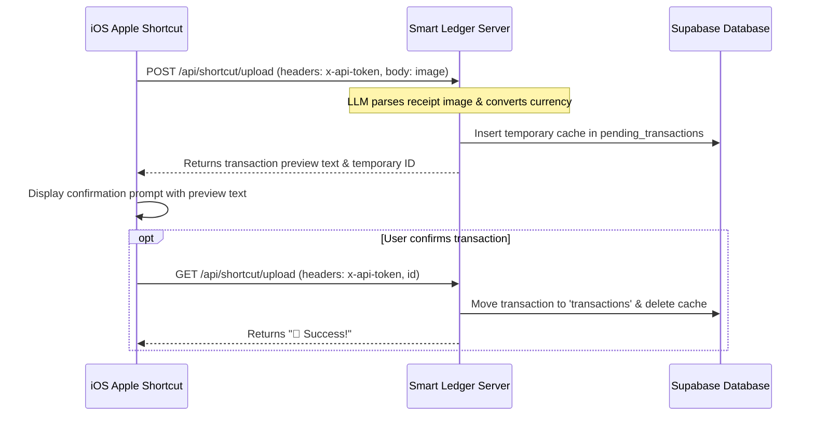

# Smart Ledger ✦

Smart Ledger is an elegant, **self-hosted, AI-powered personal finance assistant** designed for privacy-conscious users. It transforms voice recordings, receipt images, and natural conversational text into structured financial transactions under your absolute control.

---

<p align="center">
  
  
  
</p>

<p align="center">
  
  
  
</p>

---

## 🌟 Key Features

*   🛡️ **Self-Hosted & Private**
    Your financial data is yours alone. Deployed with Supabase (PostgreSQL), keeping all database records under your direct ownership.
*   🎙️ **Voice Intelligence**
    Tap, record, and let AI do the rest. Converts spoken transactions (including multi-item expense lists in a single sentence) into clean, structured records using **Groq's Whisper** transcription.
*   📷 **Receipt Vision Parsing**
    Snap a photo of any receipt or invoice. The app utilizes high-capacity vision models (**Llama 3.2 90B Vision**) to automatically extract merchant, amounts, items, taxes, currency, and categorization.
*   🧠 **LLM-Driven Categorization & Tagging**
    Intelligently suggests categories, generates appropriate transaction notes, and infers tags based on your previous spending history and preferences.
*   🔄 **Automatic Multi-Currency Exchange**
    Automatically detects transaction currencies, retrieves live exchange rates via **ExchangeRate-API**, and converts entries into your base currency seamlessly.
*   📲 **PWA (Progressive Web App)**
    Add to your home screen on iOS or Android for a fullscreen, fast, and native-feeling mobile app experience.
*   🔒 **Secure Multi-User Setup**
    Complete user isolation, verification emails powered by **Resend**, and a secure **Invite Code** system to prevent unauthorized public signups on your instance.
*   ⚡ **Apple Shortcuts Integration**
    Build quick capture workflows directly from your iPhone camera or share sheet using the integrated API Token endpoint.

---

## 🛠️ Tech Stack

*   **Frontend**: Next.js 15 (App Router), React 18, Tailwind CSS v4, Framer Motion (animations), Radix UI (accessible primitives).
*   **Database**: Supabase (PostgreSQL).
*   **Authentication**: NextAuth.js.
*   **AI Services**: Groq SDK (Whisper-large-v3, Llama-3.1-70b-versatile, Llama-3.2-90b-vision-preview).
*   **Integrations**: Resend (Transactional Email verification), ExchangeRate-API (Currency Rates lookup).

---

## 🚀 Setup & Installation

### 1. Database Configuration (Supabase)

1. Create a project on [Supabase](https://supabase.com).
2. Go to the **SQL Editor** in your Supabase dashboard.
3. Copy the contents of [`supabase_schema.sql`](file:///d:/personal%20projects/SmartLedger/supabase_schema.sql) and execute the queries to initialize the database tables:
    *   `users`: Stores credentials, settings, categories, and tags.
    *   `transactions`: Stores income and expense records.
    *   `verification_codes`: Stores email OTP verification codes.
    *   `pending_transactions`: Temporarily caches API/Shortcut transactions before confirmation.

### 2. Environment Variables Setup

Create a `.env.local` file in the root directory (based on [`example.env`](file:///d:/personal%20projects/SmartLedger/example.env)) and populate the following keys:

```env
# SUPABASE DATABASE
SUPABASE_URL=https://your-project.supabase.co
SUPABASE_SERVICE_ROLE_KEY=your-supabase-service-role-key

# AUTHENTICATION
NEXTAUTH_SECRET=a-secure-random-secret-key
NEXTAUTH_URL=http://localhost:3000

# EMAIL SERVICE (Resend)
RESEND_API_KEY=your-resend-api-key

# GROQ AI MODELS Configuration
GROQ_API_KEY=your-groq-api-key
GROQ_MODEL=llama-3.1-70b-versatile
GROQ_VISION_MODEL=llama-3.2-90b-vision-preview

# USER ACCESS SECURITY
INVITE_CODE=your-secret-invite-code-for-registration

# CURRENCY EXCHANGE RATES
EXCHANGE_RATE_API_KEY=your-exchangerate-api-key

# CORS CONFIGURATION
ALLOWED_ORIGIN=http://localhost:3000
```

---

## 💻 Running the App Locally

Ensure you have [Node.js (v18+)](https://nodejs.org) installed.

1. **Clone the repository**
   ```bash
   git clone https://github.com/Ajan2k/smart-ledger-ai-powered.git
   cd smart-ledger-ai-powered
   ```

2. **Install dependencies**
   ```bash
   npm install
   ```

3. **Start the local development server**
   ```bash
   npm run dev
   ```
   Open `http://localhost:3000` in your web browser.

---

## 📦 Deploying in Production

### Deploys to Vercel
1. Push your code to your GitHub repository.
2. Link your repository to Vercel.
3. Configure all environment variables in your Vercel project settings.
4. Click **Deploy**. Vercel will build and host your App Router endpoints automatically.

### Running with PM2 (Linux Server / VPS)
PM2 is a production-grade daemon process manager to run Next.js continuously:

1. Install PM2 globally:
   ```bash
   npm install -g pm2
   ```
2. Build the production build:
   ```bash
   npm run build
   ```
3. Start the process:
   ```bash
   pm2 start "npm run start" --name smart-ledger
   ```
4. Save the active process configuration to start on reboot:
   ```bash
   pm2 save
   pm2 startup
   ```

---

## ⚡ Apple Shortcuts Integration (iOS Guide)

Smart Ledger features an interactive verification API workflow. This lets you snap a photo on your iPhone, preview the AI-extracted transaction text, and save the transaction directly upon confirmation.

### How it works:



### iOS Shortcut Setup:

1. Log in to Smart Ledger on your browser.
2. Navigate to the **Settings** page and click **Generate API Token**. Copy this key.
3. Open the **Shortcuts App** on your iOS device and build a custom shortcut following these actions:
    *   **Take Photo** (or select a file).
    *   **Get Contents of URL** (Send POST to `https://<your-domain>/api/shortcut/upload`):
        *   Request Headers: `x-api-token` : `<YOUR_API_TOKEN>`
        *   Request Body (Form): Key `image` set to your input photo/file.
    *   **Get Value for Key `result` and `id`** from the returned JSON response.
    *   **Show Alert** (or "Choose from Menu") containing the `result` text asking if you'd like to save it.
    *   If confirmed, **Get Contents of URL** (Send GET to `https://<your-domain>/api/shortcut/upload`):
        *   Request Headers:
            *   `x-api-token` : `<YOUR_API_TOKEN>`
            *   `id` : `<THE_ID_VALUE_FROM_POST>`

---

## 🎬 Feature Demos

### 🎙️ Audio Transcription & Multiline Processing
Capture multiple records (both expenses and income) in a single spoken paragraph:

> *"I had lunch with colleagues at a Korean restaurant, spent 28 dollars. On my way home I stopped to get gas, paid 40 dollars. Also, I received my salary today — 8000 dollars just landed in my account."*


### 📷 Receipt Scanner Vision Demo
Parse a complex paper receipt image dynamically:


---

## 📄 License

This project is licensed under the [MIT License](https://mit-license.org/).
